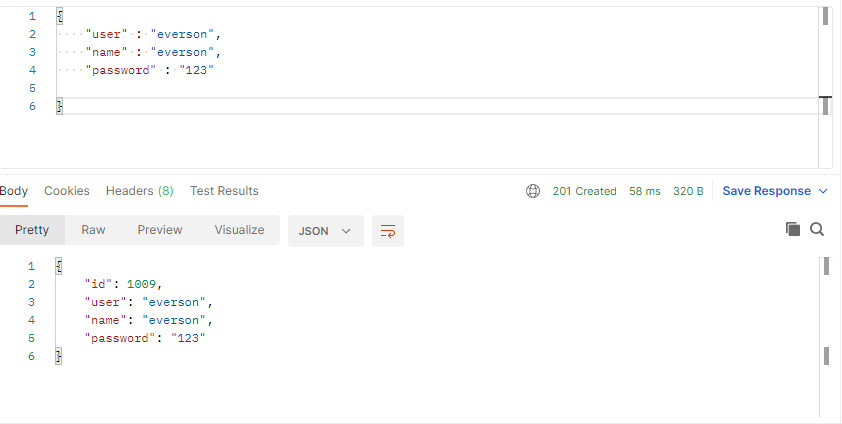
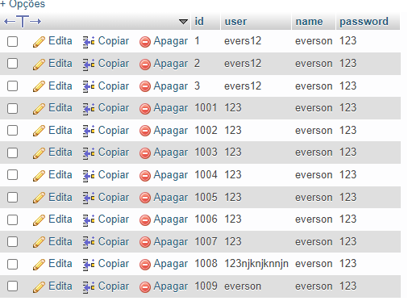
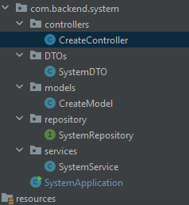

# Backend system accounts.

### Desenvolvido utilizando Spring Boot. 

- Sistema ainda não possui frontend, teste sendo realizados utilizando Postman.

Dependencies:
    
    [x] Lombok.
    [x] Spring web.
    [x] Spring boot DevTools.
    [x] Spring Data JPA.
    [x] Validation.
    [ ] Spring Security (Adicionando).

Banco de dados:
    
    [x] MariaDB

Teste criando contas:

Testes no banco:

Padrão utilizado:

### Tarefas: 

    [ ] Login system.
    [ ] Recovery account [e-mail] and [phone number]
    [ ] 2FA.
    
- [ ] Implementação do frontend (Angular).